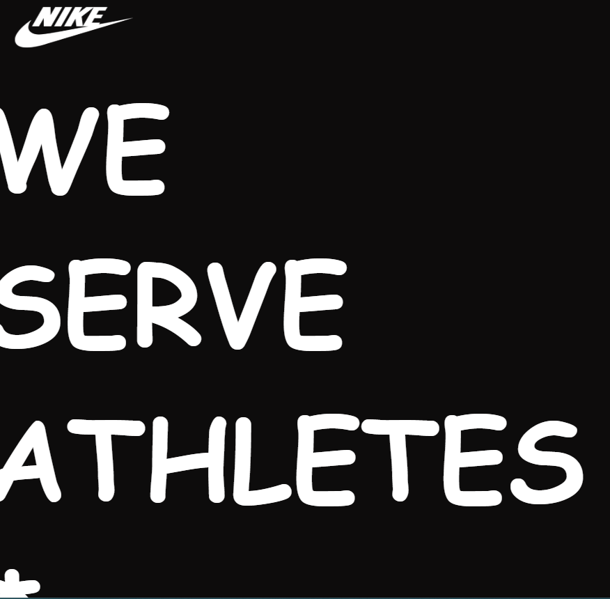
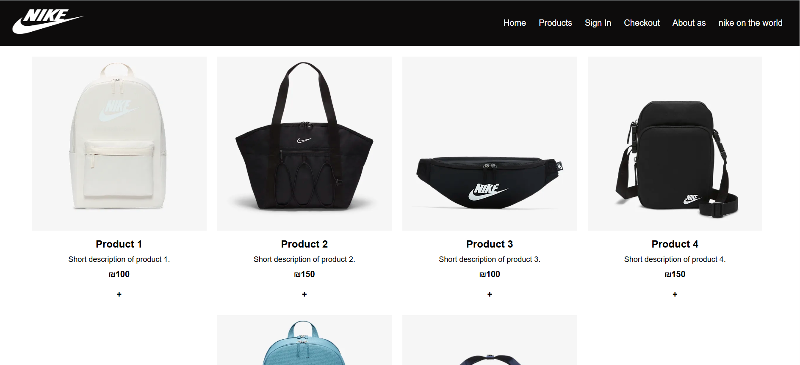
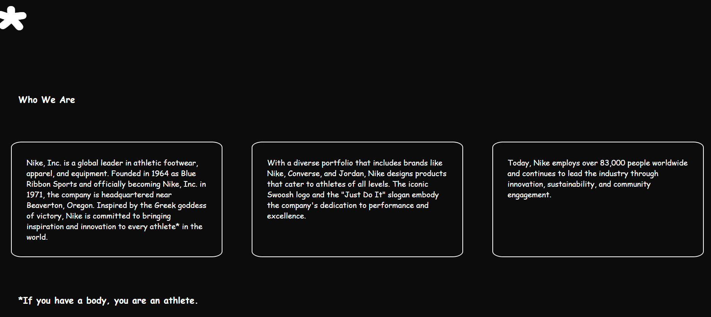

# Nike Store

Developed in 2024 to practice JavaScript and XML, this project demonstrates frontend architecture, XML-based data handling, and development using vanilla JavaScript without external frameworks.

A modern e-commerce web application built for browsing and purchasing Nike products. This project showcases a full-featured online store with product catalog, shopping cart, and checkout functionality.


## Features

- 🛍️ **Product Catalog** - Browse Nike products across multiple categories (Shoes, Jackets, Bags, Kids)
- 🛒 **Shopping Cart** - Add products to cart and manage quantities
- 💳 **Checkout** - Complete purchase with order management
- 👤 **User Authentication** - Sign in and user account management
- 📝 **Product Management** - Edit and view individual product details
- 📱 **Responsive Design** - Works seamlessly on desktop and mobile devices
- 🎨 **Modern UI** - Clean and intuitive user interface

## Tech Stack

- **Frontend Framework**: Vanilla JavaScript (ES6 Modules)
- **Build Tool**: [Vite](https://vitejs.dev/) v6.3.3
- **Markup**: HTML5
- **Styling**: CSS3
- **Data Format**: XML
- **Package Manager**: npm

## Project Structure

```
nike-store/
├── index.html              # Landing page
├── package.json            # Project dependencies
├── vite.config.js          # Vite configuration
│
├── components/             # Reusable UI components
│   ├── Header.html
│   └── Footer.html
│
├── views/                  # Page templates
│   ├── about.html
│   ├── products.html
│   ├── oneProduct.html
│   ├── editProduct.html
│   ├── cart.html
│   ├── checkout.html
│   └── signIn.html
│
├── css/                    # Stylesheets
│   ├── style.css
│   ├── products.css
│   ├── oneProduct.css
│   ├── editProduct.css
│   └── signIn.css
│
├── js/                     # Application scripts
│   ├── app.js
│   ├── api.js
│   ├── products.js
│   ├── oneProduct.js
│   ├── editProduct.js
│   └── signin.js
│
├── services/               # Business logic services
│   ├── product.js
│   ├── user.js
│   └── order.js
│
├── data/                   # Data storage
│   └── products.xml
│
└── public/                 # Static assets
    └── assets/
        ├── icons/
        └── images/
            ├── shoes/
            ├── jackets/
            ├── bags/
            └── kids/
```

## Installation

1. **Clone the repository**
   ```bash
   git clone <repository-url>
   cd nike-store
   ```

2. **Install dependencies**
   ```bash
   npm install
   ```

3. **Start the development server**
   ```bash
   npm run dev
   ```

   The application will be available at `http://localhost:5173` (or the URL shown in your terminal)

## Usage

### Development

```bash
npm run dev
```

Runs the Vite development server with hot module replacement (HMR) for instant feedback during development.

### Build

To build for production:
```bash
npm run build
```

## Key Components

- **Header** - Navigation and branding
- **Footer** - Footer information and links
- **Product Listing** - Display all available products
- **Product Details** - View detailed information about a specific product
- **Shopping Cart** - Manage selected items
- **Checkout** - Complete the purchase process
- **Sign In** - User authentication

## Services

- **Product Service** (`services/product.js`) - Handle product-related API calls
- **User Service** (`services/user.js`) - Manage user authentication and profiles
- **Order Service** (`services/order.js`) - Process and manage orders

## API Integration

The application uses a custom API layer (`js/api.js`) for server communication. Products are managed through REST endpoints with support for GET, POST, and PUT operations.

## License

ISC

## Author

Nike Store Project Team
## pictures from running appplication

## Application Screenshots

### sport page
![Home Page]

### Product Catalog
![Product Catalog]

### about nike
![Shopping Cart]